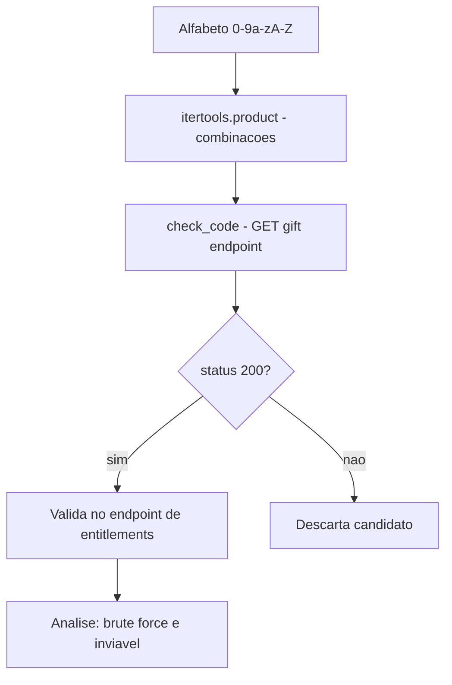

# 🎁 Discord_Gifts
<p align="center">
  
  <a href="https://github.com/panda12332145/Discord_Gifts/commits/main"></a>
  <a href="https://github.com/panda12332145/Discord_Gifts"></a>
  
</p>
---
## ⚠️ Aviso Legal / Uso Educacional

> Este projeto é **estritamente educacional** — demonstra por que a **entropia de códigos aleatórios** torna brute force inviável na prática. Testar contra a API real do Discord **viola os Termos de Serviço** e pode causar banimento da sua conta e consequências legais. Use apenas para entender o conceito de segurança de códigos de um uso só (gift codes).

---
## 🔖 Resumo

Estudo em Python sobre a segurança de **gift codes do Discord**: gera candidatos a partir de `itertools.product` sobre o alfabeto `[0-9a-zA-Z]`, consulta o endpoint público de gift codes e analisa as respostas — demonstrando na prática por que o espaço de busca de um código de 16+ caracteres é criptografamente grande demais para força bruta.

### ✨ Funcionalidades Principais

- ✅ Geração sistemática de candidatos com `itertools.product`
- ✅ Consulta ao endpoint de entitlements do Discord
- ✅ Coleta dos primeiros 10 status para análise de comportamento
- ✅ Base para discussão de entropia e rate limiting

## 📽 Demonstração

```text
$ python "discord nitro bruteforce.py"
[=] testando candidatos... (espaço de busca: 62^n)
[i] com 16 caracteres: 62^16 ≈ 4.7 × 10^28 combinações
[i] à 100 req/s: milhões de anos — brute force inviável
```

## ⚙️ Explicação das Partes Importantes

### Geração de candidatos

```python
valid_chars = string.digits + string.ascii_lowercase + string.ascii_upperity

def brute_force_code(code_length):
    for code in itertools.product(valid_chars, repeat=code_length):
        code_str = "".join(code)
        ...
```

> Produto cartesiano do alfabeto — o crescimento exponencial (`62^n`) é justamente a demonstração de segurança do projeto.

### Verificação do código

```python
def check_code(code):
    url = base_url + code
    response = requests.get(url)
    if response.status_code == 200:
        endpoint_url = f".../gift-codes/{code}?country_code=BR..."
        ...
```

> Consulta o endpoint público — em lab, aponte para um mock local em vez da API real.

## 🔄 Fluxo de Trabalho / Arquitetura



## 📂 Estrutura do Projeto

```plaintext
Discord_Gifts/
├── discord nitro bruteforce.py   # Script de estudo
└── README.md
```

## 🛠️ Tecnologias

| Ferramenta | Uso |
|---|---|
| **Python 3** | Linguagem |
| **itertools** | Geração de combinações |
| **requests** | Consultas HTTP |

## ▶️ Instalação

```bash
git clone https://github.com/panda12332145/Discord_Gifts.git
cd Discord_Gifts
pip install requests
```

## 🚀 Execução

```bash
# estude o código antes de rodar — e NÃO aponte para a API real
python "discord nitro bruteforce.py"
```

## ⚠️ Limitações

- Uso real contra a API do Discord viola os ToS
- O script contém lógica experimental com bugs (retorno de `check_code`)
- Fim acadêmico apenas

## 🚀 Roadmap

- [ ] Versão com mock local
- [ ] Análise gráfica da entropia
- [ ] Comparação com rate limit real do Discord

## 📄 Licença

Todos os direitos reservados ao autor.

---

## 👾 Autor

<p align="center">
  
</p>

<p align="center">Feito por <strong>Panda12332145</strong> 👋🏽</p>

---

## 🧑‍💻 Sobre Mim

Sou apaixonado por **Física Teórica, Cibersegurança e Desenvolvimento de Sistemas**. Tenho grande interesse em programação de baixo nível, engenharia reversa, automação, sistemas Windows, criptografia e segurança ofensiva. Também gosto bastante de música, filosofia e computação avançada.

---

## 🌐 Redes

* **Site:** [https://panda-h0me.netlify.app/](https://panda-h0me.netlify.app/)
* **YouTube:** [https://www.youtube.com/@X86BinaryGhost](https://www.youtube.com/@X86BinaryGhost)
* **Instagram:** [https://www.instagram.com/01pandal10/](https://www.instagram.com/01pandal10/)
* **GitHub:** [https://github.com/panda12332145](https://github.com/panda12332145)
* **LinkedIn:** [linkedin.com/in/athos-da-boanergis](https://www.linkedin.com/in/athos-d%C3%A3-boanergis-5585a4288/)

---

## 🚀 Áreas de Interesse

* **Cibersegurança Avançada** 🔒
* **Hacking & Engenharia Reversa** 💻
* **Computação de Baixo Nível** 🖥️
* **Matemática e Física Teórica** 📐⚛️
* **Desenvolvimento de Ferramentas de Segurança** 🛠️

_"Conhecimento é poder, e domínio técnico vem da compreensão profunda dos sistemas."_

---

## 📞 Contato & Suporte

Para colaborações, dúvidas ou sugestões:

📧 **E-mail:** [athos.cybersec@gmail.com](mailto:athos.cybersec@gmail.com)

🐛 **Reportar Bug:** [Abrir Issue](https://github.com/panda12332145/Discord_Gifts/issues)

💡 **Sugerir Melhoria:** [Discussions](https://github.com/panda12332145/Discord_Gifts/discussions)
